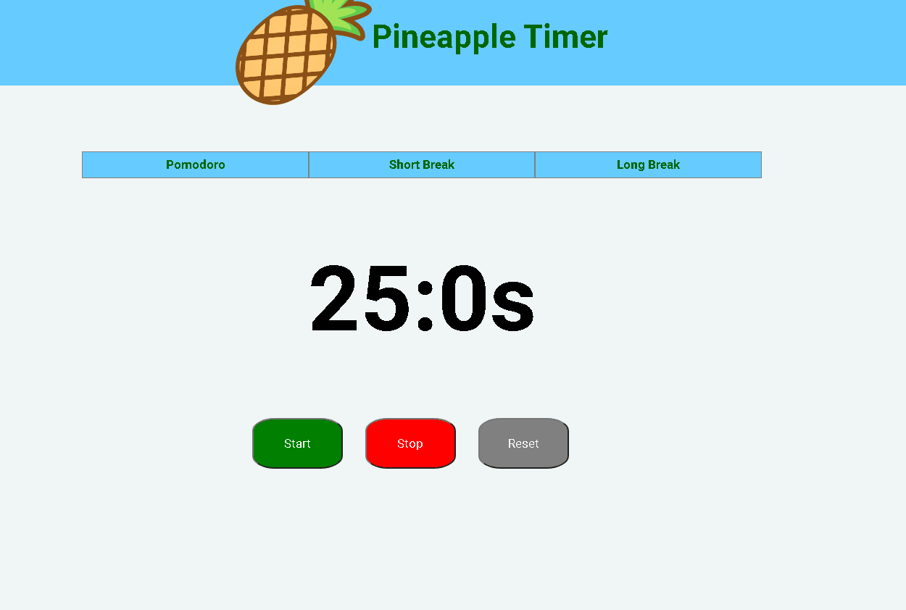

# Pineapple Timer

Pomodoro Timer created using ReactJS




### Installation

Get in the project's path , then install the dependencies with:

```sh
yarn install
```

Start it with:

```sh
yarn start
```
## Author

  **Guilherme Azevedo dos Santos**

* Github: [@g-asantos](https://github.com/g-asantos)
* Linkedin: [@guilherme-azevedo-dos-santos-417a70159](https://www.linkedin.com/in/guilherme-azevedo-dos-santos-417a70159/)

## License

[MIT](https://choosealicense.com/licenses/mit/)

